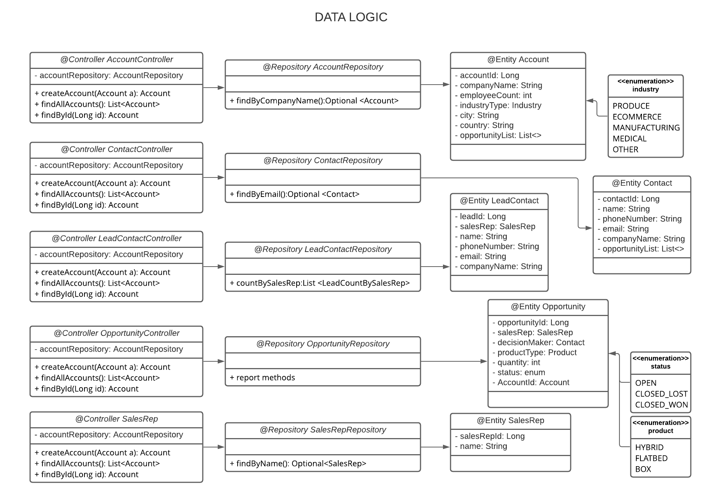

<!-- PROJECT LOGO -->
<br />
<p align="center">
  <a>
    
  </a>

<h3 align="center">CRM Project - The Data Layer</h3>

  <p align="center">
    A customer relationship management application to create, modify and delete customer information. All data is stored in a relational database.
  </p>


<!-- TABLE OF CONTENTS -->
<details open="open">
  <summary><h2 style="display: inline-block">Table of Contents</h2></summary>
  <ol>
    <li>
      <a href="#about-the-project">About The Project</a>
      <ul>
        <li><a href="#built-with">Built With</a></li>
      </ul>
    </li>
    <li>
      <a href="#getting-started">Getting Started</a>
      <ul>
        <li><a href="#prerequisites">Prerequisites</a></li>
        <li><a href="#installation">Installation</a></li>
      </ul>
    </li>
    <li><a href="#usage">Usage</a></li>
    <li><a href="#roadmap">Roadmap</a></li>
    <li><a href="#contributing">Contributing</a></li>
    <li><a href="#license">License</a></li>
    <li><a href="#contact">Contact</a></li>
    <li><a href="#acknowledgements">Acknowledgements</a></li>
  </ol>
</details>


<!-- ABOUT THE PROJECT -->
## About The Project

The objective of the project is to develop a Data Layer for a Customer Relationship 
Management application. To do that we leveraged the Spring framework and refactor the code into 
Data Access Object entities, repository interfaces and controllers.

### Built With

* [Spring](https://spring.io/)
* [Java](https://www.java.com/en/)
* [Maven](https://maven.apache.org/)
* [Lombok](https://projectlombok.org/)
* [MySQL](https://www.mysql.com/)

<!-- GETTING STARTED -->
## Getting Started

To get a local copy up and running follow these simple steps.

### Prerequisites

This a list of minimum requirements to run the program:

* [Java SE 11](https://www.oracle.com/java/technologies/javase-downloads.html)
* [MySQL Workbench 8.0 CE](https://dev.mysql.com/downloads/workbench/)

Be sure to:
1. Assign valid values in properties `spring.data.source`, `spring.data.username` and `spring.data.password`
   in `application.properties`.


### Installation

1. Clone the repo
   ```sh
   git clone https://github.com/EN-IH-WDPT-JUN21/TheDopeMob-DataLayer-Homework3.git
   ```


<!-- USAGE EXAMPLES -->
## Usage

### Start
1. Open the project on your IDE.
2. Go to the CRMApplication class in the `src` directory.
3. Run the main method.

### Help - All Commands
1. Type help into the console.
2. All valid commands will be printed.
3. All commands are case-insensitive.

### Quit
1. Type `quit` in the console.
2. Program will shut down.

### Create New Lead

* Type `new lead` in the console.
   
### Convert Lead

* Type `convert {id}` in the console.

<!-- ROADMAP -->
## Roadmap

### Class UML Diagram
<p align="center">
   
</p>
<p align="center">
   
</p>

### Use case UML Diagram
<p align="center">
   
</p>

### Next steps
* Refactor into a REST API.


<!-- CONTRIBUTING -->
## Contributing

Contributions are what make the open source community such an amazing place to learn, inspire, and create. Any contributions you make are **greatly appreciated**.

1. Fork the Project
2. Create your Feature Branch (`git checkout -b feature/AmazingFeature`)
3. Commit your Changes (`git commit -m 'Add some AmazingFeature'`)
4. Push to the Branch (`git push origin feature/AmazingFeature`)
5. Open a Pull Request


<!-- LICENSE -->
## License

Distributed under the MIT License. See `LICENSE` for more information.


<!-- CONTACT -->
## Contact

Dave Smith - [@Afexx123](https://github.com/Afexx123)

Gustavo Maldonado - [@GustavoM01](https://github.com/GustavoM01)

Jegor Chomczuk  - [@jegor-chomczuk](https://github.com/jegor-chomczuk)

Wojciech Drygas - [@WojciechDrygas](https://github.com/WojciechDrygas)

Project Link: [https://github.com/EN-IH-WDPT-JUN21/TheDopeMob-DataLayer-Homework3](https://github.com/EN-IH-WDPT-JUN21/TheDopeMob-DataLayer-Homework3)


<!-- ACKNOWLEDGEMENTS -->
## Acknowledgements

* [Ironhack Team](https://www.ironhack.com/es)
